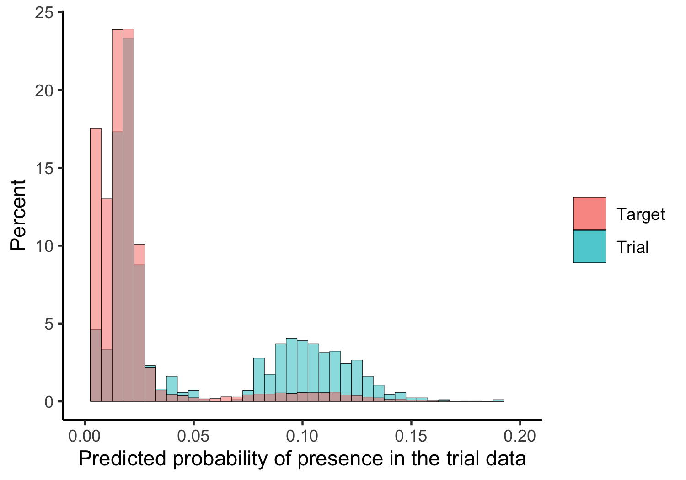

### An introduction to transporting treatment effects from randomized clinical trials to clinical practice (SER 2020 pre-conference workshop)

Friday, January 8, 2021 from 12-2pm ET

Link and password for the Zoom session are in your email

**Description**: Randomized clinical trials (RCTs) are considered the gold standard for assessing efficacy of new therapies and are required for regulatory approval. However, patients enrolled on trials are often not representative of patients in whom treatment will ultimately be delivered in clinical practice. When response to therapy varies across subgroups, differences between trial and clinical populations can contribute to the “efficacy-effectiveness gap” – where a treatment’s efficacy in a trial differs from its effectiveness in clinical practice. Methods for generalizability and transportability can help bridge this gap. These methods combine RCT and clinical practice data to generate evidence that directly addresses therapy effectiveness in target populations. Such approaches leverage the internal validity of RCTs with the external validity of clinical practice data to better inform real-world decision-making.

In this workshop, we will provide an overview of methods for generalizing and transporting treatment effects from RCTs to defined target populations. Participants will receive SAS and R code to combine publicly available RCT and real-world data. Participants will gain an understanding of the theory underlying external validity. Using graphics and quantitative metrics, participants will evaluate the suitability of and compare effect estimates transported to various target populations.

This workshop requires an introductory level of epidemiology training and is relevant for all interested in expanding their epidemiological toolkit. This workshop may be of particular interest to those focused on causal inference methods, pharmacoepidemiology, and comparative effectiveness research.

